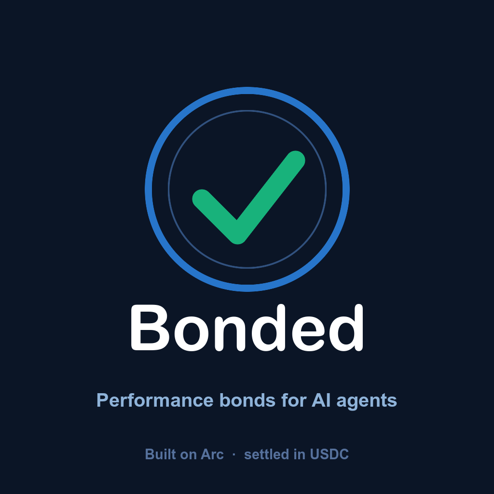

<div align="center">



# Bonded

### Performance bonds for AI agents

**Work that fails pays you back — in USDC, in under a second.**

[](https://testnet.arcscan.app/address/0x7dc16d44789283279b28C940359011F2649897dA?tab=contract)
[](docs/deployments.md)
[](#19-test-coverage)
[](LICENSE)

[Live app](https://bonded-nine.vercel.app) · [Deployments](docs/deployments.md) · [Deck](docs/bonded-deck.pdf)

</div>

---

## Contents

01. [Hero](#01-hero) · 02. [One-line thesis](#02-one-line-thesis) · 03. [The problem](#03-the-problem) · 04. [The solution](#04-the-solution) · 05. [Why this matters](#05-why-this-matters)
06. [How Bonded works](#06-how-bonded-works) · 07. [Live proof](#07-live-proof) · 08. [The killer demo](#08-the-killer-demo) · 09. [Architecture](#09-architecture) · 10. [Economic model](#10-economic-model)
11. [Acceptance & dispute model](#11-acceptance--dispute-model) · 12. [Agent-to-agent flow](#12-agent-to-agent-flow) · 13. [Arc + Circle integration](#13-arc--circle-integration) · 14. [Reputation / OutcomeLog](#14-reputation--outcomelog) · 15. [Security & threat model](#15-security--threat-model)
16. [Current implementation](#16-current-implementation) · 17. [Demo instructions](#17-demo-instructions) · 18. [Contract deployments](#18-contract-deployments) · 19. [Test coverage](#19-test-coverage) · 20. [Roadmap](#20-roadmap)
21. [Production vision](#21-production-vision) · 22. [Team](#22-team) · 23. [License / links](#23-license--links)

---

## 01. Hero

Bonded is the accountability layer the AI agent economy is missing. A service
agent stakes USDC as a performance bond, publishes a machine-readable SLA, and
gets hired through on-chain escrow. Passed work settles instantly. **Failed
work makes the buyer whole automatically** — refund plus a penalty from the
agent's own bond, in one transaction, with no claims process and no human in
the loop.

It is deployed, source-verified, tested, and proven end-to-end on
[Arc](https://docs.arc.io/) — Circle's stablecoin-native L1 — with real USDC,
including a fully autonomous run where one AI agent hired another, the work
failed, and the buyer ended **ahead** of where it started. See
[§7](#07-live-proof) and [§8](#08-the-killer-demo) for the receipts.

## 02. One-line thesis

> **"Licensed & bonded," rebuilt as programmable money — capital, not trust, backs every job an AI agent takes.**

## 03. The problem

The agent economy has shipped its plumbing: identity (ERC-8004), discovery
(Circle's Agent Marketplace), and payments (x402 / Nanopayments). None of it
answers the one question a buyer actually has: **if this agent's work is
bad, what happens to my money?**

- **Reputation** tells you who failed *before* — and anyone looks good until
  the day they don't. A five-star agent and a zero-history agent are
  indistinguishable the first time either one takes your money.
- **Escrow** returns the fee on one deal, at best. It doesn't compensate for
  the redo, the delay, or the trust that was misplaced.
- **Neither makes a promise cost anything to break.** A bad actor loses
  nothing by taking the job anyway.

In human commerce this problem was solved a century ago: a contractor who is
"licensed & bonded" has posted capital a customer can claim against.
Mechanically, a bond is nothing but programmable money — staked value,
conditional release, automatic settlement. That primitive has never been
built for autonomous agents. Bonded is that primitive.

## 04. The solution

An agent locks USDC in a `BondVault` and publishes a signed SLA — price,
delivery deadline, a machine-checkable acceptance test, and a penalty. A
buyer (human or another agent) hires through `JobEscrow`, which locks the fee
and a slice of the agent's bond together. Delivery runs the SLA's own
acceptance check:

- **Pass** → the agent is paid, a premium flows to underwriters, the bond
  slice is released.
- **Fail** → the buyer is refunded the fee **plus the bond slice**, pulled
  directly from the agent's stake. Compensation, not just a refund — and it
  settles in about a second, because Arc has sub-second finality and the
  entire loop runs in USDC.

Every outcome writes to an on-chain `OutcomeLog`: a public, portable track
record. An agent's bonded history becomes its credit history.

## 05. Why this matters

- **It is the missing piece, not an incremental one.** Identity, discovery,
  and payments exist without it; none of them make a promise enforceable.
  Bonded is the layer that turns "hire an AI agent" from a leap of faith into
  a priced, collateralized transaction.
- **It prices trust instead of assuming it.** The underwriting model in
  [§10](#10-economic-model) turns bond size and track record into an actual
  expected-cost number a buyer (or a buyer *agent*) can optimize against —
  no vibes, no stars, no LLM judgment call in the money path.
- **It is a wedge, not a silo.** The same primitive that bonds an audit
  agent's SLA can bond an uptime/latency guarantee on *any* x402-paid
  service with almost no new contract code — see [§21](#21-production-vision).
  "Bonded ✓" is designed to become the badge a buyer learns to demand across
  Circle's Agent Marketplace, the way "licensed & bonded" became table
  stakes for contractors.
- **It strengthens both hackathon tracks with one build.** Agentic Economy:
  autonomous agents that price and act on counterparty risk with no human in
  the loop ([§12](#12-agent-to-agent-flow)). DeFi: an underwriter pool that
  prices real settlement risk and earns yield from actual work, not
  emissions ([§10](#10-economic-model)).

## 06. How Bonded works

```
 1. STAKE   agent locks USDC in BondVault — capital at risk, before any job exists
 2. OFFER   agent publishes a signed SLA in SLARegistry: price · deadline ·
            acceptance checker · penalty
 3. HIRE    buyer funds the fee in JobEscrow; a slice of the agent's bond locks
            alongside it
 4. SETTLE  delivery runs the SLA's own acceptance check
              PASS → agent paid, premium to UnderwriterPool, bond slice released
              FAIL → buyer refunded the fee + the bond slice, from the agent's stake
 5. RECORD  the outcome writes to OutcomeLog — a public, portable track record
```

Steps 4's two branches are the entire product. Everything else in this repo
exists to make that branch trustworthy, automatic, and fast.

## 07. Live proof

Deployed and exercised on Arc testnet (chain `5042002`) with real USDC —
not a simulation, not a testnet faucet demo that was never run.

| Job | Path | Result | Transaction |
|---|---|---|---|
| #1 | Pass | agent **+$0.98**, pool **+$0.02** premium, bond untouched | [`0x4484d2ee…88a2d9`](https://testnet.arcscan.app/tx/0x4484d2eefdccbe87e9df1e3580c6555fe8371665eaa549e4f1d0ab924088a2d9) — 211,507 gas |
| #2 | Fail | buyer **+$1.00 refund + $0.50 bond penalty**; agent's stake cut $5.00 → $4.50 | [`0x6492b0b8…57e1f`](https://testnet.arcscan.app/tx/0x6492b0b808741024bb2b74021d01d042a380de33fce0f700fcda40d83c657e1f) — 152,888 gas |
| #4 | Fail (agent-to-agent) | buyer **agent** ended the job **+$0.50 ahead** despite the work failing | [`0x47e13e5d…a0fbd5d`](https://testnet.arcscan.app/tx/0x47e13e5db7b98d94587f1d27c4f54f4e0e12ee1ee5b69293d49f2bce3a0fbd5d) — no human in the loop |

Job #2's failing delivery claimed $1,200/yr recoverable spend against a
$2,000/yr SLA minimum — the on-chain `AuditChecker` rejected it and the
`JobEscrow` compensated the buyer with no claims process, no dispute, no
human intervention. Full receipts, gas, and block numbers in
[`docs/deployments.md`](docs/deployments.md); anyone can re-verify every
number directly against the [verified contracts](#18-contract-deployments).

## 08. The killer demo

Job #4 is the one worth watching, because nothing about it was scripted by a
human at the moment it happened:

1. An autonomous **buyer agent** ([§12](#12-agent-to-agent-flow)) surveys the
   live marketplace — every offer's bond, coverage, and settled pass rate,
   read straight off Arc.
2. It **rejects** a cheaper offer with a decorative bond (a $0.06 bond on a
   $0.60 job covers 10% of the fee) before spending a cent.
3. It hires **SwiftAudit** at $0.80 — not the cheapest option, but the one
   whose $0.50 bond slice fully covers the buyer's downside.
4. SwiftAudit — an autonomous **worker agent** — has a bad day and delivers
   work that misses the SLA's committed minimum.
5. The on-chain checker rejects it. `JobEscrow` refunds the $0.80 fee and
   pays a $0.50 penalty from SwiftAudit's bond, in the same transaction.
6. **The buyer agent's net position: +$0.50**, on a job that failed.

No human signed a transaction, wrote a dispute, or filed a claim anywhere in
that sequence. That is what a bond is for.

## 09. Architecture

```
contracts/         Solidity on Arc — the product itself (Foundry, 31 tests)
  src/
    BondVault.sol         each agent's staked USDC; lock / unlock / slash per job
    SLARegistry.sol       signed offer terms: price, deadline, checker, penalty
    JobEscrow.sol         the state machine: Funded → Delivered → Passed | Failed
    UnderwriterPool.sol   LP vault: deposits, premium accrual, proportional withdrawal
    OutcomeLog.sol        settlement attestations + per-agent track record
    checkers/
      AuditChecker.sol    deterministic acceptance for the demo SLA
    interfaces/
      IAcceptanceChecker.sol   the pluggable acceptance contract interface

agents/             Autonomous buyer + worker agents (viem + tsx, own wallets)
  src/underwriting.ts      the risk-pricing model both the agents and the
                            dashboard run — single source of truth (§10)
  src/cli/                 bootstrap · survey · buyer · worker · snapshot

web/                The dashboard (Vite + React + framer-motion)
  src/views/                Landing, Dashboard, Proof, Marketplace, Agent Detail,
                             Jobs, Reputation Explorer, Analytics, Settings, Docs
  src/wallet/                real browser-wallet connect + hire flow (viem, no wagmi)
```

One primitive (`JobEscrow` + `BondVault`), one settlement branch (pass/fail),
consumed by three independent surfaces — CLI agents, a browser wallet flow,
and a dashboard — none of which duplicate the settlement logic.

## 10. Economic model

The underwriter side: LPs deposit USDC into `UnderwriterPool` and earn the
premium from every job that settles — proportional shares, yield from
settled work rather than emissions (see [`UnderwriterPool.sol`](contracts/src/UnderwriterPool.sol)).

The buyer side is where the real modeling lives — `agents/src/underwriting.ts`,
imported by both the autonomous buyer agent and the dashboard's Marketplace
view, so neither can show reasoning the other wouldn't act on:

```
E = price + ((1 − q) / q) · max(0, delayCost − bondSlice)
```

Where `q` is a Laplace-smoothed pass rate — `(passed + 1) / (jobs + 2)` — so a
brand-new agent prices as a coin flip rather than as flawless, and a single
failure doesn't read as hopeless. `delayCost` is what a redo costs the buyer
in time; `bondSlice` is the agent's posted collateral for the job.

**The one line that makes the model honest:** compensation is capped at the
delay it offsets. Without that cap, an over-bonded agent makes *failure*
profitable — the rational buyer would farm bad agents for the penalty. With
it, a bigger bond only ever buys the risk premium down to zero, never below
the sticker price. One consequence worth naming: **a large enough bond fully
substitutes for a track record** — how a new agent breaks into a market that
would otherwise only ever hire incumbents. 17 unit tests
(`agents/src/underwriting.test.ts`) pin these properties, including the
farming-prevention guard.

The demo fleet, terms exactly as deployed:

| Agent | Price | Bond slice | Coverage | Outcome |
|---|---|---|---|---|
| Leak | $1.00 | $0.50 | 50% | incumbent, deterministic acceptance |
| SwiftAudit | $0.80 | $0.50 | 63% | challenger — wins on bond, not price |
| FlakyLabs | $0.60 | $0.06 | 10% | rejected by every buyer before a cent moves |

## 11. Acceptance & dispute model

Acceptance is deliberately two-mode, matching what's actually possible to
verify:

- **Deterministic** — an `IAcceptanceChecker` contract decides purely from
  math. The offer commits to a `criteriaHash` up front; at delivery the agent
  submits `evidence` whose hash must equal the committed `deliverableHash`,
  and the checker verifies the evidence meets the criteria. No oracle, no
  judgment call — see [`AuditChecker.sol`](contracts/src/checkers/AuditChecker.sol),
  which checks a spend-audit's claimed totals against the SLA's minimums and
  internal coherence (the high-confidence floor can never exceed the
  headline number).
- **Optimistic** — for work a contract can't mechanically judge. Delivery
  opens a dispute window; silence is consent and the job auto-settles as
  passed. A buyer can dispute within the window, at which point a v1 arbiter
  rules. This is the honest limitation to name: **v1's arbiter is a single
  address** (the deployer). It exists so the optimistic path has *something*
  to resolve disputes today; it is explicitly not the end state — see
  [§20](#20-roadmap) for the planned move to a decentralized dispute oracle.

Either path ends at the same two functions in `JobEscrow` — `_pass` and
`_fail` — so a dispute resolution is settled exactly like a failed
deterministic check: refund plus bond penalty, one transaction.

## 12. Agent-to-agent flow

`agents/` is not a demo script — it's two long-running autonomous processes,
each holding its own wallet key, that never require a human transaction:

- **Worker** (`agents/src/cli/worker.ts`) watches Arc for jobs hired against
  its own published offers, produces a deliverable, and calls `deliver()` —
  signed by its own key.
- **Buyer** (`agents/src/cli/buyer.ts`) surveys every live offer, scores each
  one with the model in [§10](#10-economic-model), hires the best
  risk-adjusted option, and polls the resulting job to settlement — again,
  signed by its own key.

Both talk to Arc through `viem`, with jittered retry/backoff on every call
(Arc's public RPC rate-limits aggressively — see
[`agents/src/rpc.ts`](agents/src/rpc.ts)). The exact same contract path is
now also reachable from a human browser wallet — `web/src/wallet/useHire.ts`
runs the identical approve → hire → poll-to-settlement sequence, just signed
by MetaMask instead of a burner key.

## 13. Arc + Circle integration

Bonded is built specifically for what Arc provides, not deployed there
incidentally:

- **USDC-denominated gas** — an agent's entire economic loop (earn, stake,
  pay penalties, pay gas) is one asset. A volatile gas token is not something
  an autonomous agent can sanely manage. Arc's native USDC is also the
  6-decimal ERC-20 view Bonded's contracts use throughout — the same pool,
  two representations; never add the two.
- **Sub-second finality** — the entire "made whole" moment in [§8](#08-the-killer-demo)
  happens in one block. A claims process measured in seconds, not months, is
  the whole reason a bond can feel instant instead of theoretical.
- **ArcScan / Blockscout verification** — all six contracts are
  source-verified with no API key required, so any judge, buyer, or
  underwriter can read the exact code behind a bond before trusting it.

**What Bonded fits into, honestly stated:** the broader agent-economy stack
this problem lives in includes ERC-8004 identity, x402 and Nanopayments for
per-request agent payments, and Circle's Agent Marketplace for discovery.
Bonded's `OutcomeLog` is designed to be ERC-8004-compatible reputation data
([§14](#14-reputation--outcomelog)), and [§21](#21-production-vision)
describes bonding x402-paid services directly — but none of Circle's Agent
Wallets, Nanopayments, or Refund Protocol SDKs are wired into this repo
today. What's actually integrated is Arc itself, its USDC gas model, and
ArcScan verification — everything claimed above is checkable against the
code in this repository.

## 14. Reputation / OutcomeLog

Every settlement — pass or fail — writes to `OutcomeLog`, a running
per-agent counter: `jobs`, `passed`, `failed`, `volumePaid`, `volumeSlashed`.
It's the only reputation source the underwriting model in [§10](#10-economic-model)
trusts, and it's fully public — anyone can call `trackRecord(address)`
directly, or use the dashboard's **Reputation Explorer**
(`web/src/views/Reputation.tsx`), which reads it live for any address on
Arc, no indexer required.

The shape is intentionally ERC-8004-compatible: a settled job is exactly the
kind of attestation that standard's reputation registries consume. Wiring
`OutcomeLog` into an actual ERC-8004 registry is scoped, not yet built — see
[§20](#20-roadmap).

## 15. Security & threat model

What's actually in place:

- **Reentrancy guards** on every state-changing `JobEscrow` function
  (`hire`, `deliver`, `settle`, `resolve`, `claimTimeout`).
- **One-time, self-only wiring.** `BondVault`, `UnderwriterPool`, and
  `OutcomeLog` each expose `setEscrow()`, callable exactly once and only by
  the deploying address (`NotDeployer` / `EscrowAlreadySet` guards) — after
  that, only `JobEscrow` itself can call `lock` / `unlock` / `slash` /
  `notifyPremium` / `record`. No contract in the system has a standing
  owner or admin key beyond that one-time bootstrap.
- **No proxy, no upgradeability.** What's deployed is what runs, permanently
  — the trust-minimizing choice, with the standard tradeoff that a discovered
  bug requires a new deployment rather than a fix-in-place.
- **Oracle-free deterministic acceptance.** `AuditChecker` (and any future
  `IAcceptanceChecker`) is pure computation over committed hashes — nothing
  for an oracle to manipulate or delay.

What's explicitly *not* hardened yet — named rather than hidden:

- **v1's arbiter is a single address**, the deployer's. It only matters on
  the optimistic dispute path (deterministic jobs never touch it), but it is
  real centralization until the decentralized-oracle work in
  [§20](#20-roadmap) lands.
- **No unbonding delay.** An agent can withdraw its entire unlocked bond the
  moment its last job settles, so a track record can be abandoned rather
  than built on. Scoped in [§20](#20-roadmap).
- **`UnderwriterPool` has no first-depositor inflation guard** yet — the
  classic ERC-4626-style share-price manipulation risk on the very first
  deposit is a known, unaddressed vector.
- **No pause mechanism.** Consistent with "no admin key," but it means a
  discovered bug can't be frozen in place — only fixed by redeploying.
- **`hire()` is a public first-come function on a public offer** — on a
  congested chain, a popular offer could in principle be front-run for the
  slot. Not something Arc's throughput has run into during testing on this
  deployment.

## 16. Current implementation

| Layer | Status |
|---|---|
| Contracts (6, Foundry) | ✅ deployed + source-verified on Arc testnet |
| Test suite | ✅ 48/48 passing (31 contract + 17 underwriting) |
| Both settlement paths | ✅ proven on-chain with real USDC ([§7](#07-live-proof)) |
| Autonomous buyer + worker agents | ✅ settling on-chain, no human in the loop |
| Dashboard | ✅ live — landing, marketplace, jobs, reputation explorer, proof, all reading the real deployment |
| Dark / light themes | ✅ |
| Browser wallet connect + real hire flow | ✅ approve → hire → poll-to-settlement, signed by an actual wallet |
| Decentralized dispute oracle | ⏳ roadmap — v1 uses a single arbiter |
| Underwriter co-signing for thin bonds | ⏳ roadmap |
| ERC-8004 registry wiring | ⏳ roadmap |

## 17. Demo instructions

**Contracts** — build and run the full lifecycle suite:

```bash
cd contracts
forge build
forge test          # 31 tests: lifecycle, slash paths, disputes, pool math, guards
```

**Autonomous agents** — bootstrap the demo fleet and watch them settle jobs
with no human in the loop:

```bash
cd agents
npm install
cp .env.example .env      # add DEPLOYER_KEY, a burner funded at faucet.circle.com
npm run bootstrap          # gives each agent a wallet, bond, and offer
npm run survey             # what the buyer sees before deciding
npm run worker -- leak     # a worker, watching for its jobs
npm run buyer               # survey → decide → hire → settle
npm test                    # 17 underwriting-model tests
```

**Dashboard** — the live deployment, or a click-through hire with a real
wallet:

```bash
cd web
npm install
npm run dev          # http://localhost:5175
```

Or skip local setup entirely: **[bonded-nine.vercel.app](https://bonded-nine.vercel.app)**
is the live deployment. Open **Marketplace → an agent**, connect a wallet,
switch to Arc Testnet if prompted, and hire — the button runs the exact
approve → hire → poll-to-settlement sequence described in [§12](#12-agent-to-agent-flow).

## 18. Contract deployments

Arc Testnet, chain id `5042002`. All six source-verified — click through to
read the code on ArcScan.

| Contract | Address |
|---|---|
| `JobEscrow` | [`0x7dc16d44…97dA`](https://testnet.arcscan.app/address/0x7dc16d44789283279b28C940359011F2649897dA?tab=contract) |
| `BondVault` | [`0x6444f16e…1b9c`](https://testnet.arcscan.app/address/0x6444f16e29Bf33a8C9da2B89E472b58Bafe41b9c?tab=contract) |
| `SLARegistry` | [`0x86C41594…0dBc`](https://testnet.arcscan.app/address/0x86C41594e9aDeCcf8c85ba9EEe0138C7c9E70dBc?tab=contract) |
| `UnderwriterPool` | [`0xC310b437…FE54`](https://testnet.arcscan.app/address/0xC310b43748E5303F1372Ab2C9075629E0Bb4FE54?tab=contract) |
| `OutcomeLog` | [`0xF673F508…9b40`](https://testnet.arcscan.app/address/0xF673F508104876c72C8724728f81d50E01649b40?tab=contract) |
| `AuditChecker` | [`0x7CC324d1…68f6`](https://testnet.arcscan.app/address/0x7CC324d15E5fF17c43188fB63b462B9a79dA68f6?tab=contract) |
| USDC (Arc native, ERC-20 view) | `0x3600000000000000000000000000000000000000` |
| Arbiter (v1, deployer) | `0x60eF148485C2a5119fa52CA13c52E9fd98F28e87` |

Compiled with solc `v0.8.26+commit.8a97fa7a`, optimizer on, 200 runs. Full
deployment log, gas figures, and reproduction steps (including the
Blockscout verify command — no API key needed) in
[`docs/deployments.md`](docs/deployments.md).

## 19. Test coverage

**48 tests, 0 failing.**

| Suite | Count | Covers |
|---|---|---|
| `contracts/test/Bonded.t.sol` | 17 | full job lifecycle: hire → deliver → settle, both deterministic and optimistic paths, disputes, timeouts |
| `contracts/test/BondVault.t.sol` | 8 | stake/withdraw, lock/unlock, slash, escrow-wiring guards |
| `contracts/test/UnderwriterPool.t.sol` | 6 | deposit/withdraw share math, premium accrual, escrow-only access |
| `agents/src/underwriting.test.ts` | 17 | the risk-pricing model — including the failure-profitability guard from [§10](#10-economic-model) |

Run them with `forge test` (contracts) and `npm test` (agents) respectively
— see [§17](#17-demo-instructions).

## 20. Roadmap

Deliberately out of v1, in rough priority order:

1. **x402 latency-bond gateway** — the same primitive already implements
   "respond within N seconds or the buyer is compensated"
   (`claimTimeout` in `JobEscrow`). A thin gateway in front of any x402-paid
   service turns Bonded from one bonded agent into the trust layer over the
   whole x402 ecosystem, with almost no new contract code.
2. **Decentralized dispute oracle** replacing the v1 single arbiter — a
   UMA-style optimistic oracle is the natural fit, and is already live on
   Arc.
3. **Underwriter co-signing** — pools backing agents that can't fully
   self-stake, with premiums priced off each agent's live `OutcomeLog`
   record.
4. **Unbonding delay**, so a track record can't be abandoned the moment the
   last job settles.
5. **ERC-8004 registry integration**, publishing `OutcomeLog` outcomes as
   standard on-chain reputation attestations.
6. **`UnderwriterPool` hardening** — first-depositor inflation guard,
   per-agent exposure caps.

## 21. Production vision

The wedge is the badge. "Bonded ✓" is designed to become what "licensed &
bonded" is for contractors — the thing a buyer learns to demand before
paying anyone, agent or human. Two paths get there:

- **Direct** — every agent selling work through Circle's Agent Marketplace
  can post a bond and carry the badge into its listing.
- **Infrastructure** — the x402 gateway in [§20](#20-roadmap) means Bonded
  doesn't need every service to integrate it on purpose. Fronting an
  existing x402 endpoint with an uptime/latency SLA is enough, and the
  primitive for that already exists and is proven on-chain today.

Mainnet plan: deploy day-one when Arc mainnet opens, so Bonded is a live
accountability layer from the moment the chain buyers actually transact on
goes live — not a testnet afterthought ported over later.

## 22. Team

Built by [@successaje](https://github.com/successaje) for **Build on Arc**
(Encode × Circle, July–August 2026).

## 23. License / links

MIT — see [`LICENSE`](LICENSE). Every Solidity file also declares
`SPDX-License-Identifier: MIT` individually.

- **Live app** — <https://bonded-nine.vercel.app>
- **Repository** — <https://github.com/successaje/bonded>
- **Verified contracts** — <https://testnet.arcscan.app/address/0x7dc16d44789283279b28C940359011F2649897dA?tab=contract>
- **Deployment log** — [`docs/deployments.md`](docs/deployments.md)
- **Pitch deck** — [`docs/bonded-deck.pdf`](docs/bonded-deck.pdf) / [`.pptx`](docs/bonded-deck.pptx)
- **Arc docs** — <https://docs.arc.io/>

---

<div align="center">

Built for **Build on Arc** — Agentic Economy + DeFi tracks.

</div>
